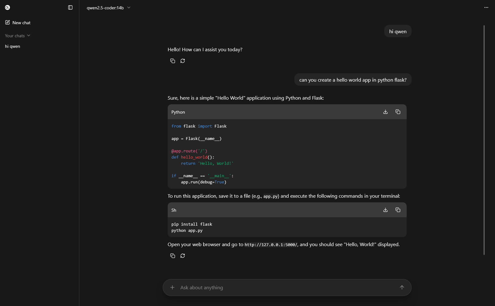

  

# Open Ollama UI

Ollama interface without the hassle of downloading locally, while being open-source.

## Set up

You need to create a new environmental variable named `OLLAMA_ORIGINS` with the value `*://neverusedgithub.github.io` (if the variable already exists separate the existing origins and the new origin with a comma, for example `*://some-other-site.com,*://neverusedgithub.github.io`).

## Usage

[Just open the Github Pages link!](https://neverusedgithub.github.io/open-ollama-ui/)

## Disclaimer

Some of the app's features use some hardcoded models currently, these are (both from ollama):
- qwen3:4b-instruct
- translategemma:12b

## Features

- Streaming responses. (Ollama API)
- Modern looking interface. (ChatGPT inspired)
- Saved chats. (IndexedDB)
- Tool support.
  - Image generation tool. (ComfyUI API)  
    **Requires models installed in ComfyUI, see [workflows/z_image_turbo.json](./src/imagegen/workflows/z_image_turbo.json)**
  - Web search tool. (Brave API + support extension)
  - Web fetch tool. (support extension)
  - File search tool.
  - File summary tool.
  - Custom tool syntax for models without native tool support.
- In-browser RAG solution.
  - Ollama API for embeddings.
  - Separate vector database per chat.
  - PDF parsing. (text based, could be extended to OCR)
- Code & LaTeX highlighting/rendering.
- Visible and collapsible thinking blocks.
- Good performance.
  - SolidJS as choice of framework.
  - Uses [streaming-markdown](https://github.com/thetarnav/streaming-markdown) to render markdown quick.
